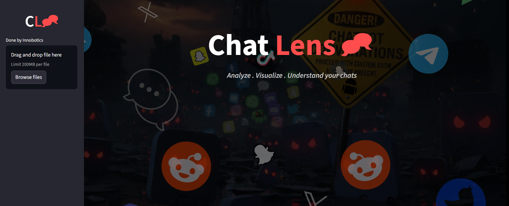
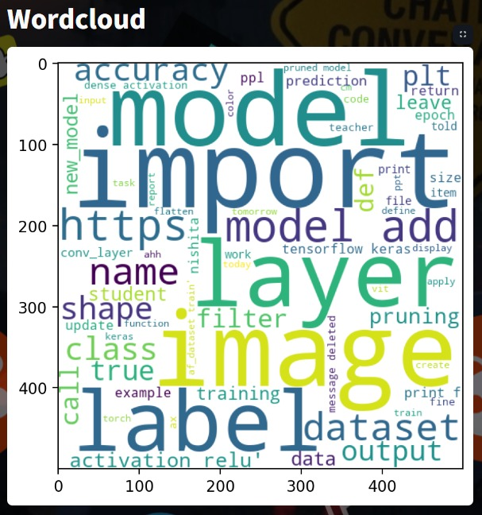
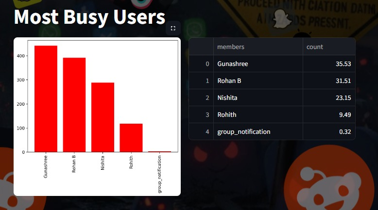
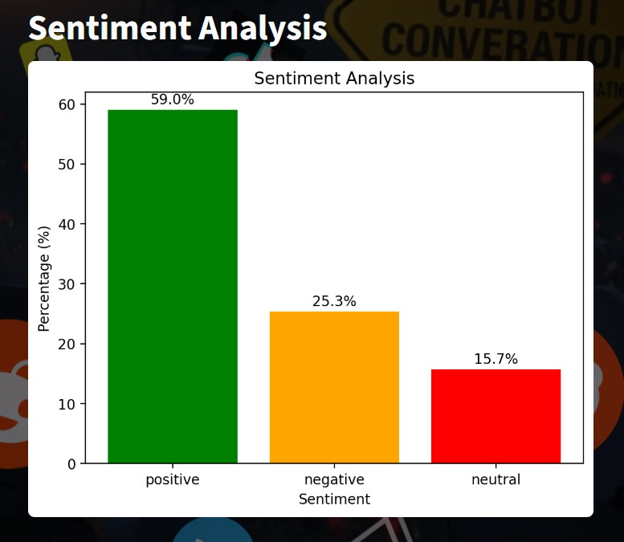
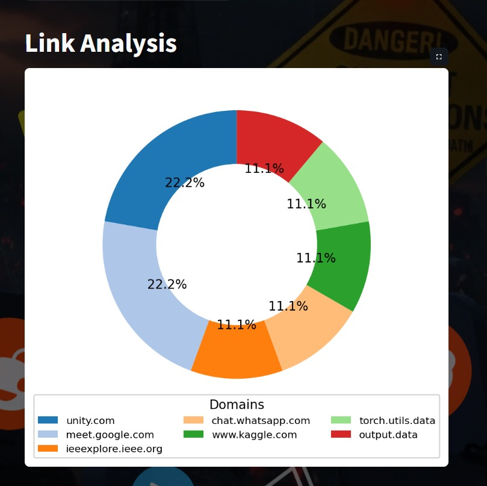
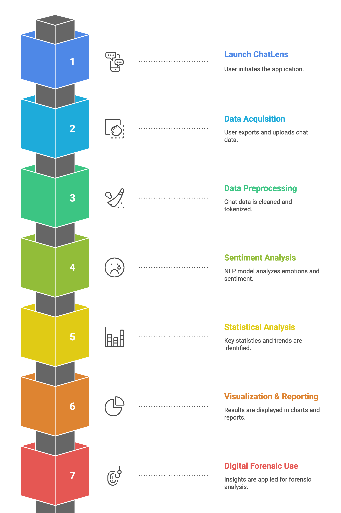

## **QRystal**

##  Overview

ChatLens is an intelligent chat analysis tool that processes exported WhatsApp or Telegram chats to extract insights using NLP techniques. It visualizes patterns like message frequency, activity trends, and emotional tone. Built with Streamlit, it provides an interactive, user-friendly interface for real-time exploration. The tool automatically structures chat data into a readable format. Overall, it helps users understand their communication behavior through visual analytics.

<p align="center">
  
  <br>
  
</p>

## Features


*    Real-time QR code scanning using the device camera
*    On-device ML model to classify safe vs suspicious URLs
*    Instant fraud detection with clear results to the user
*    Works offline after installation — no need for internet for model inference
*    User-friendly mobile UI built for fast and secure usage

## Problem Definition and Objective
People exchange countless messages daily, making it hard to manually analyze conversations. ChatLens addresses this challenge by transforming unstructured chat logs into meaningful insights. Its main objective is to identify trends, emotions, and user activity through automated text processing. The tool performs sentiment classification and presents data visually for better understanding. It simplifies analyzing personal or group chat behavior efficiently.


## Project Structure

The project is divided into two main components:

### 1. Backend (ML Model Training)

- Built using Python for data processing, model training, and analysis logic.
- Uses preprocessor.py for cleaning and structuring raw chat data (removing timestamps, media tags, etc.).
- Employs a Naive Bayes sentiment analysis model for classifying messages as positive, negative, or neutral.
- Integrates helper.py to handle analytics functions like timelines, activity maps, word frequency, and emoji analysis.
- Generates visual outputs dynamically using Matplotlib and Seaborn for statistical insights.
- Ensures modular design — separating preprocessing, analysis, and visualization components for scalability.
- Handles all computations securely on the user’s local system, maintaining chat privacy and data confidentiality.


### 2. Frontend (UI) Features
- Built using Streamlit.
- Has a sidebar for input and selection.
- Automatically updates visualizations dynamically.
- Displays charts (matplotlib, seaborn) and dataframes neatly in the main area.
- Title and sections are well organized (st.title(), st.header(), etc.).


## How It Works

*   User uploads the exported chat file (in .txt format) from WhatsApp or other platforms.
*   The preprocessor cleans and structures the raw data into a usable format.
*   NLP-based functions extract metrics, detect sentiment, and visualize patterns.
*   A Naive Bayes model classifies messages into sentiment categories.
*   Results are displayed on an interactive Streamlit dashboard with visual insights.


## Result


<p align="center">
  
  <br>
  <em>Wordcloud</em>
</p>

<p align="center">
  
  <br>
  <em>Most Busy Users</em>
</p>

<p align="center">
  
  <br>
  <em>Sentimental Analysis</em>
</p>

<p align="center">
  
  <br>
  <em>Link Analysis</em>
</p>


## System Architecture
<p align="center">
  
  <br>
  <em>System Workflow</em>
</p>


## Performance

ChatLens demonstrates high accuracy in sentiment prediction, with classification results consistently exceeding 85% across all sentiment categories. The system efficiently processes even large chat exports while maintaining smooth visual rendering and responsiveness. Its combination of NLP preprocessing and the Naive Bayes model ensures quick, reliable, and interpretable analysis suitable for real-time user insights.


### Prerequisites

- Python 3.8 or above installed on the system.

- Required libraries: Streamlit, Pandas, Matplotlib, Seaborn, Scikit-learn.

- Exported chat file in .txt format (from WhatsApp or supported apps).

- A functional internet browser to run and view the Streamlit dashboard.
  


### Installation

1. Clone this repository
2. Set up the Virtual environment:
   ```
   py -m venv .venv
   .venv\Scripts\activate  
   
   ```  
3. Run the app:
   ```
   pip install -r requirements.txt
   py app.py  
   
   ```
### Deployment

Go through my website using this link - [ChatLens](https://chat-lens.streamlit.app/)

or scan the QR Code
<p align="left">
  
  <br>
</p>

